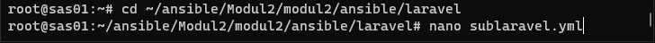
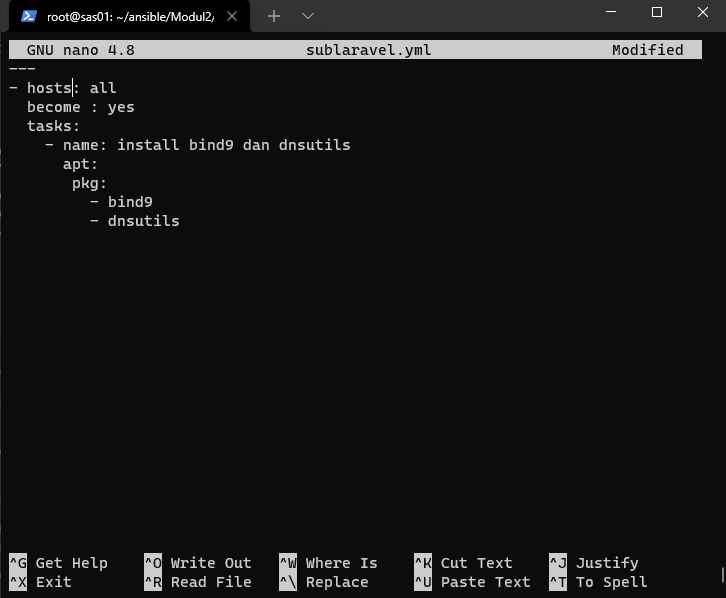
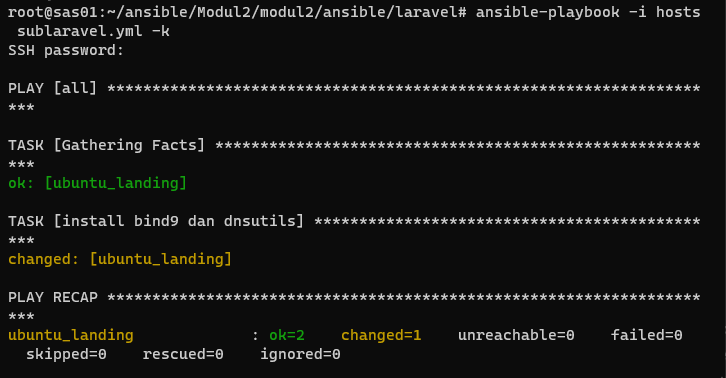
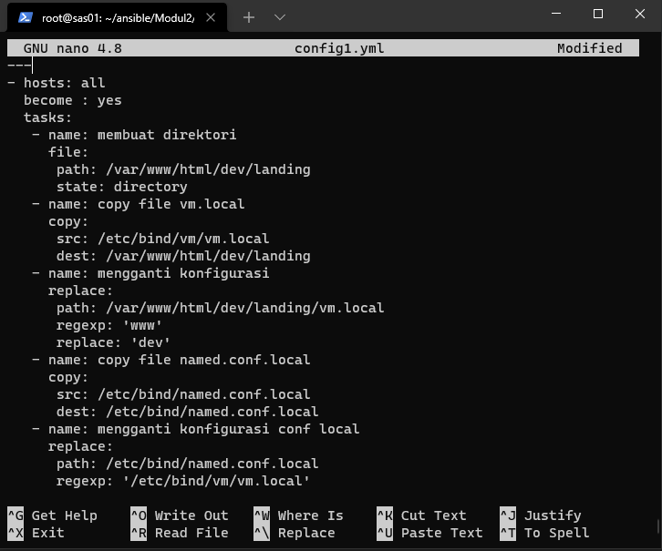
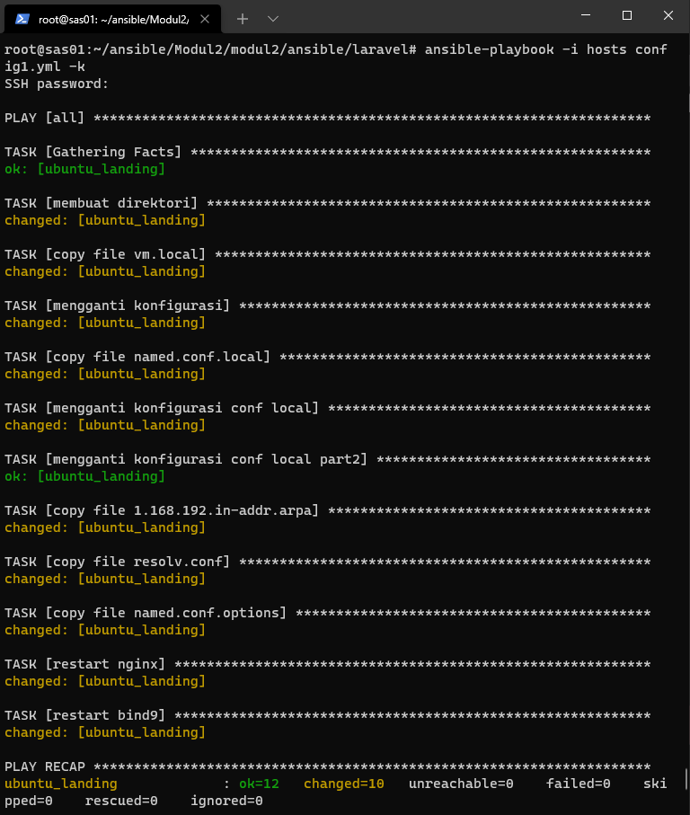
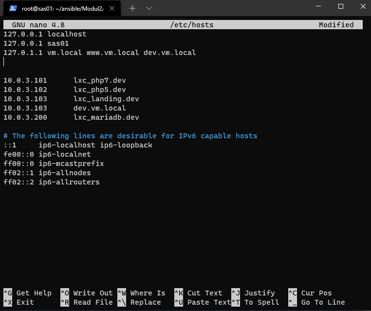
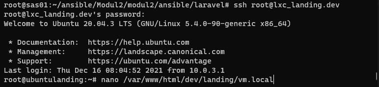
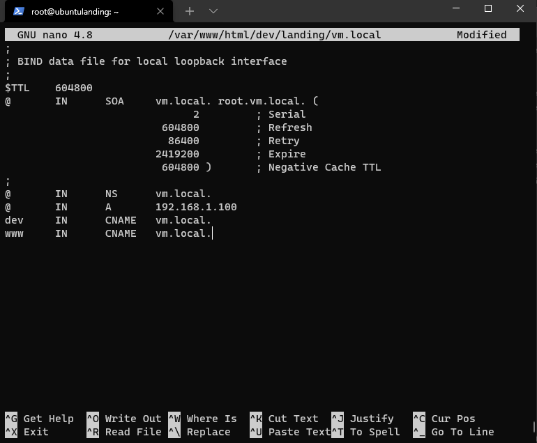
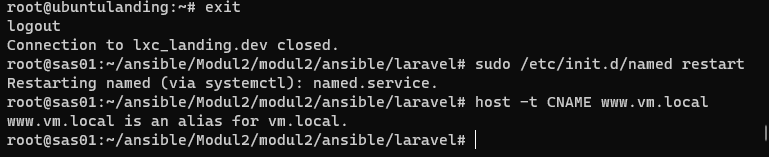
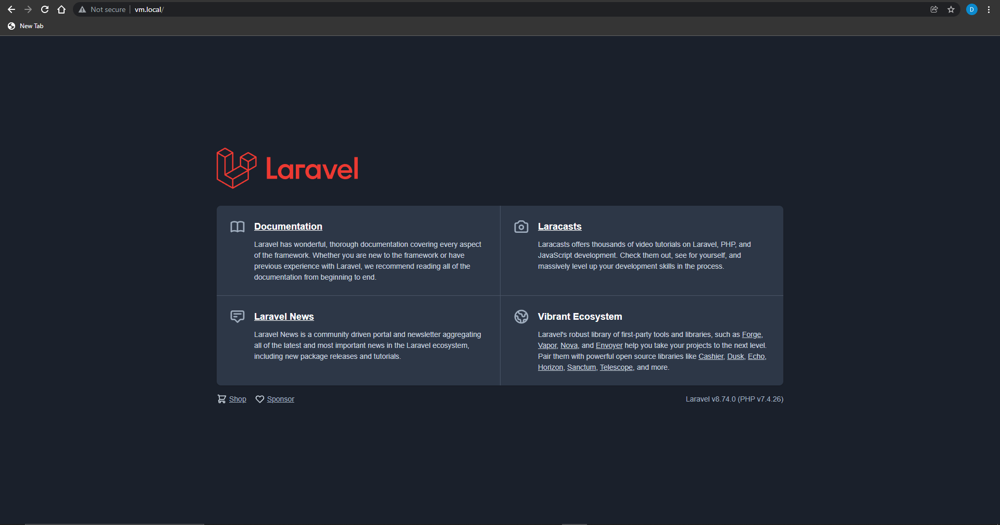

# Praktikum Modul 3

# Study Case

```
Kelompok 9 : 
1. Difa Taufiqurahman 1202199005
2. Alvyano Rizqilla 1202190035
```

 - The first step is to go to the directory using ansible
 




```
 ---
- hosts: all
  become : yes
  tasks:
    - name: install bind9 dan dnsutils
      apt:
       pkg:
         - bind9
         - dnsutils
```

- After going to the laravel.yml web directory. The next step is to re-install



- Then Create a file e config1.yml



```
 ---
- hosts: all
  become : yes
  tasks:
   - name: membuat direktori
     file:
      path: /var/www/html/dev/landing
      state: directory
   - name: copy file vm.local
     copy:
      src: /etc/bind/vm/vm.local
      dest: /var/www/html/dev/landing
   - name: mengganti konfigurasi
     replace:
      path: /var/www/html/dev/landing/vm.local
      regexp: 'www'
      replace: 'dev'
   - name: copy file named.conf.local
     copy:
      src: /etc/bind/named.conf.local
      dest: /etc/bind/named.conf.local
   - name: mengganti konfigurasi conf local
     replace:
      path: /etc/bind/named.conf.local
      regexp: '/etc/bind/vm/vm.local'
      replace: '/var/www/html/dev/landing/vm.local'
   - name: mengganti konfigurasi conf local part2
     replace:
      path: /etc/bind/named.conf.local
      regexp: '/etc/bind/vm/1.168.192.in-addr.arpa'
      replace: '/var/www/html/dev/landing/1.168.192.in-addr.arpa'
   - name: copy file 1.168.192.in-addr.arpa
     copy:
      src: /etc/bind/vm/1.168.192.in-addr.arpa
      dest: /var/www/html/dev/landing
   - name: copy file resolv.conf
     copy:
      src: /etc/resolv.conf
      dest: /etc/resolv.conf
   - name: copy file named.conf.options
     copy:
      src: /etc/bind/named.conf.options
      dest: /etc/bind/named.conf.options
   - name: restart nginx
     service:
      name: nginx
      state: restarted
   - name: restart bind9
     action: service name=bind9 state=restarted
```

- Perform the installation using the command and script below



- Add subdomain to /etc/hosts



- Then open the vm.local file



- Add the www line to the vm.local file



- The final step is to exit and the web will appear in vm.local/



- Open and edit vm.local in directory /etc/nginx/sites-enabled/


- Edit vm.local add "dev.www.vm.local;"


- Open and edit vm.local in directory /etc/bind/vm/


- Restart all packages


- Open Change Adaptor Settings (in the case we use Windows and LAN) thats why we choosed ethernet not WiFi. uncheck internet protocol version (TCP/IPv6)


- Open internet protocol version (TCP/IPv4) properties, change DNS with ip like a image


- and check vm.local/ in the browser




